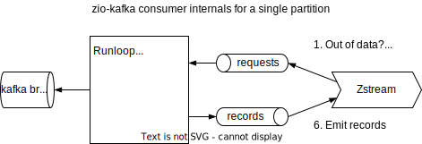

Zio-kafka's consumer can be tuned for:

* throughput
* latency
* memory usage

All tuning is done via `ConsumerSettings`:

```scala
val settings = ConsumerSettings(bootstrapServers)
  .withGroupId(groupId)
  .withProperties(properties)
  .... etc.
```

Read on for more details.

## Names

Two very similarly named settings are relevant. Don't mix them up:

* `pollTimeout` — how long a poll may take
* `max.poll.interval.ms` — the maximum time between polls

## Throughput and latency

The kafka client can be tuned for either high throughput or low latency, unfortunately not both.
The most important settings for tuning throughput and latency are:

* zio-kafka's `pollTimeout` — This is the maximum time to block while polling the Kafka consumer. Zio-kafka's default
  is `50ms` which is good for low latency applications. Set this higher, e.g. `500ms` for better throughput.
* kafka's [configuration `max.poll.records`](https://kafka.apache.org/documentation/#consumerconfigs_max.poll.records) — The maximum number of records a poll will return. Kafka defaults
  this to `500`. You can set this higher for more throughput, or lower for lower latency.
* zio-kafka's fetch-strategy `partitionPreFetchBufferLimit` — when the number of records in a partition queue is
  at or below this value, zio-kafka will start to pre-fetch and buffer more records from Kafka. The default value for
  this parameter is `1024`; 2 * the default `max.poll.records` of 500, rounded to the nearest power of 2.

Zio-kafka provides 2 methods that set these settings for 2 common use cases: `ConsumerSettings.tuneForHighThroughput`
and `ConsumerSettings.tuneForLowLatency`.
Note that their implementation may vary over time. You can use them as follows:

```scala
val highThroughputSettings = ConsumerSettings(bootstrapServers).tuneForHighThroughput
val lowLatencySettings = ConsumerSettings(bootstrapServers).tuneForLowLatency
```

## Small and large records

Kafka’s performance is not very sensitive to record size. However, when records become very small (< 100 bytes) it
might be beneficial to increase `max.poll.records` and `partitionPreFetchBufferLimit`. Similarly, when records are
very large (> 100Kb), `max.poll.records` can be decreased. Also, pre-fetching can be limited by decreasing
`partitionPreFetchBufferLimit` or even disabled by using `ConsumerSettngs.withoutPartitionPreFetching`.

## High number of partitions

When a lot of partitions need to be consumed, we need to take into account that heap is needed to store the records in
the partition queues. A very rough estimate for the maximum amount of heap needed is given by: `average record size` *
`number of of partitions` * max(`partitionPreFetchBufferLimit`, `max.poll.records`).

The total can be tuned by changing the `partitionPreFetchBufferLimit`, `max.poll.records` settings.

Another option is to write a custom `FetchStrategy`. For example the `ManyPartitionsQueueSizeBasedFetchStrategy` in
[draft PR 970](https://github.com/zio/zio-kafka/pull/970) (merged into zio-kafka since 2.8.1).

## Long processing durations

To detect stalled consumers, Kafka revokes a partition when a consumer does not poll within the max poll interval (see
[configuration `max.poll.interval.ms`](https://kafka.apache.org/documentation/#consumerconfigs_max.poll.interval.ms)). The default max poll interval is 5 minutes. After a partition is revoked,
it will be assigned to another consumer.

In zio-kafka (versions 2.5.1+) a stream needs to pull data within the max poll interval. If this doesn't happen, the
stream is interrupted with a failure and the whole consumer shuts down.

To see if your application must be configured with a higher `max.poll.interval.ms` value we need to consider the
maximum duration between polls. If processing is sequential, we can obtain this maximum by multiplying
`max.poll.records` with the maximum duration to process a single record. To also accommodate things like long garbage
collections and buffering, configuration `max.poll.interval.ms` should be substantially higher than the maximum
processing time.

`max.poll.interval.ms` can be set with:

```scala
  .withMaxPollInterval(15.minutes)
```

On older zio-kafka versions `withMaxPollInterval` is not available. Use the following instead:

```scala
  .withProperty("max.poll.interval.ms", 15.minutes.toMillis.toString)
```

⚠️In zio-kafka versions 2.2 up to 2.5.0 it may also be necessary to increase the `runloopTimeout` setting.
When no stream is processing data for this amount of time (while new data is available), the consumer will halt with a
failure. In zio-kafka 2.5.0 `runloopTimeout` defaults to 4 minutes, a little bit lower than `max.poll.interval.ms`.

## Using metrics to tune the consumer

Zio-Kafka exposes [metrics](metrics.md) that can be used to further tune the consumer. To interpret these metrics you need to know how zio-kafka works internally.



The runloop is at the heart of every zio-kafka consumer.
It creates a zstream for each partition, eventually this is the zstream your applications consumes from.
When the zstream starts, and every time the records queue is empty, it sends a request for data to the runloop.
The request causes the runloop to resume the partition so that the next poll may receive records.
Any received records are put in the records queue.
When the queue reaches a certain size (as determined by the configured `FetchStrategy`), the partition is paused.
Meanwhile, the zstream reads from the queue and emits the records to your application.

An optimally configured consumer has the following properties:

- the zstreams never have to wait for new records (to get high throughput),
- most of the time, the record queues are empty (to get low latency and low heap usage).

The following strategy can help you get to this state:

1. First make sure that `pollTimeout` and `max.poll.records` make sense for the latency and throughput requirements
   of your application.
2. Configure `partitionPreFetchBufferLimit` to `0`.
3. Observe metric `ziokafka_consumer_queue_polls` which gives the number of polls during which records are idling in
   the queue.
4. Increase `partitionPreFetchBufferLimit` in steps until most measurements of the `ziokafka_consumer_queue_polls`
   histogram are in the `0` bucket .

During this process, it is useful to observe metric `ziokafka_consumer_queue_size` (number of records in the queues) to
see if the queues are indeed increasing in size.

When many (hundreds of) partitions need to be consumed, the metric `ziokafka_consumer_all_queue_size` should also be
observed as increasing `partitionPreFetchBufferLimit` can lead to high heap usage. (See 'High number of partitions'
above.)
