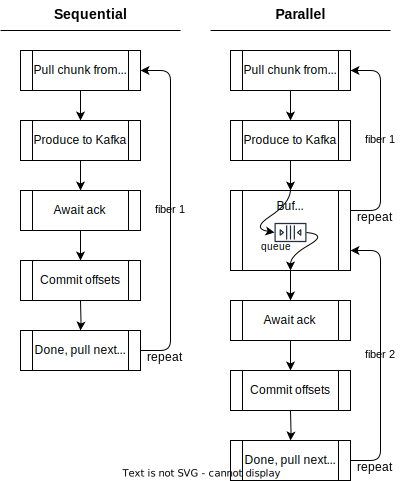

Consuming from Kafka and then producing a transformed message back to Kafka, is a regular pattern in systems that use
Kafka. This page shows an example of an application that does this. Next we discuss how throughput can be improved.

This page is also useful as a deep dive into producing to Kafka with data from other streaming sources.

# Example application

This is what the example application does:

1. consumes messages from topic `topic_a`,
2. transforms the received records,
3. produces the transformed records to topic `topic_b`,
4. commits the consumer offsets.

The application uses the zio-kafka streaming APIs. We need to explicitly commit offsets; applications that use the
streaming API process records asynchronously with the consumer, and therefore, committing offsets automatically is not
possible.

```scala
import zio.kafka.consumer._
import zio.kafka.producer._
import zio.kafka.serde._
import org.apache.kafka.clients.producer.ProducerRecord

val consumerSettings: ConsumerSettings =
  ConsumerSettings(List("localhost:9092")).withGroupId("my-application")
val producerSettings: ProducerSettings =
  ProducerSettings(List("localhost:9092"))

for {
  consumer <- Consumer.make(consumerSettings)
  producer <- Producer.make(producerSettings, Serde.int, Serde.string)
  _ <-
    consumer
      // Create a stream of records, consuming all records from a topic
      .plainStream(Subscription.topics("my-input-topic"), Serde.int, Serde.long)
      // Convert every record in a ProducerRecord, and the ConsumerRecord's offset
      .map { record =>
        val key: Int = record.record.key()
        val value: Long = record.record.value()
        val newValue: String = value.toString

        val producerRecord: ProducerRecord[Int, String] =
          new ProducerRecord("my-output-topic", key, newValue)
        (producerRecord, record.offset)
      }
      // For every chunk of producerRecords and offsets
      .mapChunksZIO { chunk =>
        val records = chunk.map(_._1)
        val offsetBatch = OffsetBatch(chunk.map(_._2))

        // produce the chunk of records, when acked by kafka, commit the consumed offsets,
        // returning an empty chunk (`mapChunksZIO` requires this function to return a ZIO[Chunk])
        producer.produceChunk[Any, Int, String](records) *>
          offsetBatch.commit.as(Chunk.empty)
      }
      .runDrain
} yield ()
```

### Performance analysis

To analyze throughput performance of a zio-streams program, it is important to find out the characteristics of the
stream's chunks, and to make sure that the chunking structure stays intact. (See [avoiding
chunk-breakers](avoiding-chunk-breakers.md) for more information.)

The program above uses a zio-kafka consumer as stream source. Kafka consumers poll the broker to get new records.
Zio-kafka guarantees that all records that were received in a poll for a given partition, are in the same stream chunk.
This is ideal; partitions can be processed in parallel, and we can process as many records as are available.

By default, the zio-kafka consumer does pre-fetching. The result is that as soon as the stream processed a chunk of
records, the next chunk of records is already available. This increases throughput compared to having to wait for the
next poll.

The next operation —`map`— keeps the chunking structure intact. Nothing to improve here.

The next operation —`mapChunksZIO`— also keeps the chunking structure intact. In this operator, we produce a chunk of
records. Once they are acknowledged by the Kafka broker, we commit the offsets of the consumed records.

### Optimizing consumer throughput

Let's zoom in on the consumer part of the example program.

Method `plainStream` produces a single stream, and chunks from different partitions are processed serially. At the
cost of making the program more complex, we can increase throughput with per-partition parallel processing. See
[consuming with more parallelism](consuming-kafka-topics-using-zio-streams#consuming-with-more-parallelism) for more
details. On this page, we do not explore this optimization further.

Zio-kafka's prefetching automatically adapts and is usually as good as it can be. Only for very small/large records, or
for large amounts of topics, you may need to configure it better. Please see [consumer tuning](consumer-tuning) to find
out how.

### Optimizing producer throughput

ℹ️ Know your domain. In cases where messages need to be produced in a certain order, the techniques in this section are
not suitable.

Let's focus on the producer part of the program, that is, the `mapChunksZIO` operation in the example above. The
operator pulls a chunk of records from upstream, produces that chunk to Kafka, awaits the acknowledgements, and then the
process repeats. All these tasks are executed sequentially.

We can optimize througput by pulling and producing the next chunk of records concurrently with waiting for the
acknowledgements.

To implement this with zio-streams, we need to split the `mapChunksZIO` operation from the example above in separate
stream operations:

1. produce the records
2. await the acknowledgements and commits offsets

We then use the `buffer` operator between those operations. Buffer allows upstream to run ahead in a separate fiber.

The following diagram compares the two approaches. The rectangles represent stream operations.



And now in code. Replace the `mapChunksZIO` operator with the following code:

```scala
  // Expose the chunking structure of the stream
  .chunks         // ZStream[_, _, Chunk[(ProducerRecord, Offset)]]

  // For every exposed chunk
  .mapZIO { chunk =>
    val records = chunk.map(_._1)
    val offsetBatch = OffsetBatch(chunk.map(_._2))
    // Produce asynchronously
    producer.produceChunkAsync(records, Serde.int, Serde.string)
      .map(await => (await, offsetBatch))
  }               // ZStream[_, _, (Task[Chunk[RecordMetadata]], OffsetBatch)]

  // Allow the producer to run ahead, producing up to 4 extra chunks
  .buffer(4)      // ZStream[_, _, (Task[Chunk[RecordMetadata]], OffsetBatch)]

  // Await acknowledgements for a chunk, and commit
  .mapZIO { case (await, offsetBatch) =>
    // 'await' is a ZIO, run it, and then commit offsets
    await *> offsetBatch.commit
  }               // ZStream[_, _, Unit]
```

Method `producer.produceChunkAsync` returns a `Task[Task[]]`. The outer task completes when the records have been sent.
Completion gives us the inner task, which completes when the acknowledgements are received.

In the code we use `buffer(4)` which allows the program to produce up to 4 extra chunk of records while awaiting
acknowledgements.

#### Aside, when commits are not needed

When commits are not needed, we can simplify the code a bit:

```scala
val stream: ZStream[_, _, ProducerRecord] = ???

stream
  // Expose the chunking structure of the stream
  .chunks         // ZStream[_, _, Chunk[ProducerRecord]]
  // Every chunk gets produced asynchronously
  .mapZIO { records =>
    producer.produceChunkAsync(records, Serde.int, Serde.string)
  }               // ZStream[_, _, Task[Chunk[RecordMetadata]]]
  // Allow the producer to run ahead, producing up to 4 extra chunks
  .buffer(4)      // ZStream[_, _, Task[Chunk[RecordMetadata]]]
  // Await acknowledgements per chunk
  .flattenZIO     // ZStream[_, _, Chunk[RecordMetadata]]
```

### Optimizing committing consumer offsets

Commiting offsets can become the bottleneck in highly optimized zio-kafka programs. This is because high commit rates
can put a high strain on the broker. Next up, we split off committing to its own fiber as well by using
`aggregateAsyncWithin`. See [consuming with zio-streams](consuming-kafka-topics-using-zio-streams) to learn how this
works.

Replace the part after `.buffer()` with:

```scala
  // Await acknowledgements for a chunk 
  .mapZIO { case (await, offsetBatch) =>
    // 'await' is a ZIO, run it, and then return the offsets
    await.as(offsetBatch)
  }                   // ZStream[_, _, OffsetBatch]
  .aggregateAsyncWithin(Consumer.offsetBatches, Schedule.fixed(100.millis))
                      // ZStream[_, _, OffsetBatch]
  .mapZIO(_.commit)   // ZStream[_, _, Unit]
```

