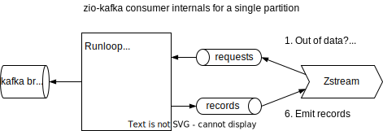
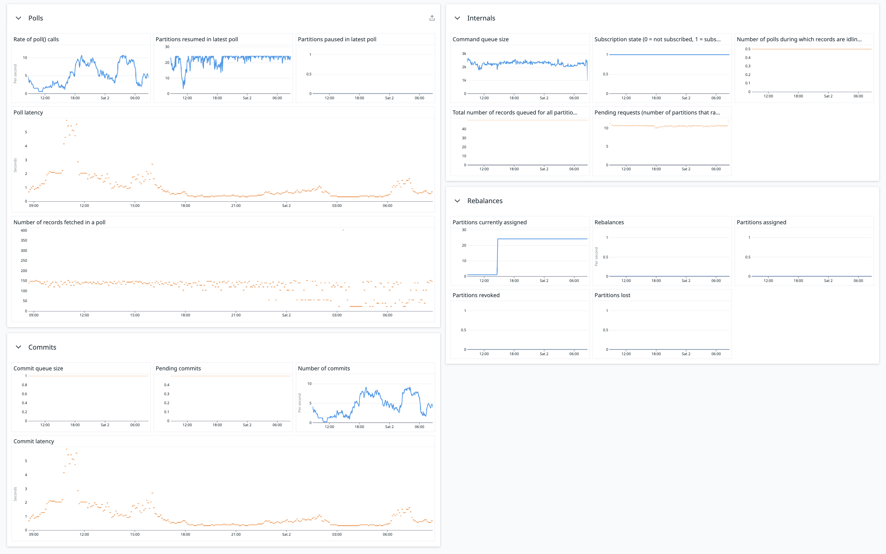
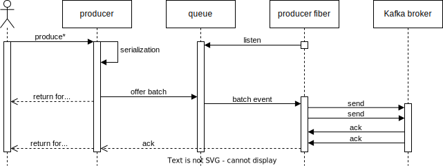

Zio-kafka exposes all the metrics of the wrapped Java based consumer and producer, plus some more metrics about the
zio-kafka consumer itself.

## Java client metrics

The metrics from the Java metrics can be obtained via the `Consumer.metrics` and `Producer.metrics` methods. Both
return a live view on the internal metrics of the consumer/producer. We currently do not expose these metrics elsewhere,
a PR to copy them to the zio-metrics API is welcome.

## Zio-kafka metrics

The zio-kafka consumer and producer collects some additional metrics using the zio-metrics API. This allows any
zio-metrics backend to access and process the observed values.

By default, no tags are added. Tags can be configured via `ConsumerSettings.withMetricsLabels` / `ProducerSettings.withMetricsLabels`.

Like the zio-metrics we follow Prometheus conventions. This means that:

- durations are expressed in seconds,
- counters can only increase,
- metric names use snake_case and end with the unit name where possible.

The histograms each use 10 buckets. To reach a decent range while keeping sufficient accuracy at the low end, most
bucket boundaries use an exponential series based on 𝑒.

## Zio-kafka consumer metrics

To interpret the metrics you need to know how zio-kafka works internally.

See the [tuning guide](consumer-tuning.md#using-metrics-to-tune-the-consumer) for more details on the internals.

### Poll metrics

| Type      | Name                                                  | Description                                                                        |
|-----------|-------------------------------------------------------|------------------------------------------------------------------------------------|
| counter   | `ziokafka_consumer_polls`                             | The number of polls.                                                               |
| histogram | `ziokafka_consumer_poll_latency_seconds`              | The duration of a single poll in seconds.                                          |
| histogram | `ziokafka_consumer_poll_size`                         | The number of records fetched by a single poll.                                    |
| gauge     | `ziokafka_consumer_partitions_resumed_in_latest_poll` | The number of partitions resumed in the latest poll call.                          |
| gauge     | `ziokafka_consumer_partitions_paused_in_latest_poll`  | The number of partitions paused in the latest poll call (because of backpressure). |
| counter   | `ziokafka_consumer_poll_auth_errors`                  | The number of polls that ended with an authentication or authorization error.      |

### Partition stream metrics

These metrics are updated after every poll.

| Type      | Name                                 | Description                                                            |
|-----------|--------------------------------------|------------------------------------------------------------------------|
| histogram | `ziokafka_consumer_pending_requests` | The number of partitions that ran out of records (the queue is empty). |
| histogram | `ziokafka_consumer_queue_size`       | The number of records queued for a partition.                          |
| histogram | `ziokafka_consumer_all_queue_size`   | The total number of records queued for all partitions.                 |
| histogram | `ziokafka_consumer_queue_polls`      | The number of polls during which records are idling in a queue.        |

### Commit metrics

These metrics measure the separate commit requests issued through zio-kafka's api.

| Type       | Name                                       | Description                                         |
|------------|--------------------------------------------|-----------------------------------------------------|
| histogram  | `ziokafka_consumer_pending_commits`        | The number of commits that are awaiting completion. |
| counterInt | `ziokafka_consumer_commits`                | The number of commits.                              |
| histogram  | `ziokafka_consumer_commit_latency_seconds` | The duration of a commit in seconds.                |

### Aggregated commit metrics

After every poll zio-kafka combines all outstanding commit requests into 1 aggregated commit. These metrics are for the aggregated commits.

| Type       | Name                                                  | Description                                                                |
|------------|-------------------------------------------------------|----------------------------------------------------------------------------|
| counterInt | `ziokafka_consumer_aggregated_commits`                | The number of aggregated commits.                                          |
| histogram  | `ziokafka_consumer_aggregated_commit_latency_seconds` | The duration of an aggregated commit in seconds.                           |
| histogram  | `ziokafka_consumer_aggregated_commit_size`            | An approximation of the number of records (offsets) per aggregated commit. |

### Rebalance metrics

| Type       | Name                                              | Description                                                  |
|------------|---------------------------------------------------|--------------------------------------------------------------|
| counterInt | `ziokafka_consumer_rebalances`                    | The number of rebalances.                                    |
| gauge      | `ziokafka_consumer_partitions_currently_assigned` | The number of partitions currently assigned to the consumer. |
| counterInt | `ziokafka_consumer_partitions_assigned`           | The number of partitions assigned to the consumer.           |
| counterInt | `ziokafka_consumer_partitions_revoked`            | The number of partitions revoked to the consumer.            |
| counterInt | `ziokafka_consumer_partitions_lost`               | The number of partitions lost to the consumer.               |

### Runloop metrics

These metrics are updated after every poll.

| Type      | Name                                   | Description                                        |
|-----------|----------------------------------------|----------------------------------------------------|
| gauge     | `ziokafka_consumer_subscription_state` | Whether the consumer is subscribed (1) or not (0). |
| histogram | `ziokafka_consumer_command_queue_size` | The number of commands queued in the consumer.     |
| histogram | `ziokafka_consumer_commit_queue_size`  | The number of commits queued in the consumer.      |

See [ConsumerMetrics.scala](https://github.com/zio/zio-kafka/blob/master/zio-kafka/src/main/scala/zio/kafka/consumer/internal/ConsumerMetrics.scala) for the exact details.

## Example

Here is an example dashboard that could be built with these metrics:

## Zio-kafka producer metrics

To understand the producer metrics it useful to know how the producer works.

When you call the producer it first serializes the given batch of records (a single record is treated like a batch of
one). The batch is then offered to an internal send queue. Once the queue accepts the batch, the `produce*Async` methods
return immediately. The `produce*Sync` methods return later, when all acknowledgements are in. Once the fiber is ready
for it, it pulls a batch from the queue and sends the records to the Kafka broker one by one. Meanwhile, the broker
acknowledges records.

### Producer metrics

| Type      | Name                                | Description                                                                             |
|-----------|-------------------------------------|-----------------------------------------------------------------------------------------|
| counter   | `ziokafka_producer_calls`           | The number of times a produce method is invoked.                                        |
| histogram | `ziokafka_producer_latency_seconds` | The duration of a single produce, from after serialization to acknowledged, in seconds. |
| counter   | `ziokafka_producer_records`         | The number of records produced.                                                         |
| histogram | `ziokafka_producer_batch_size`      | The number of records per produce call.                                                 |

### Queue metrics

| Type      | Name                                           | Description                                                     |
|-----------|------------------------------------------------|-----------------------------------------------------------------|
| histogram | `ziokafka_producer_send_queue_size`            | The number of records in the zio-kafka send queue.              |
| histogram | `ziokafka_producer_send_queue_latency_seconds` | Time in send queue, including waiting for capacity, in seconds. |

### Send metrics

| Type    | Name                            | Description                                                                           |
|---------|---------------------------------|---------------------------------------------------------------------------------------|
| counter | `ziokafka_producer_auth_errors` | The number of record sends that resulted in an authentication or authorization error. |

See [ProducerMetrics.scala](https://github.com/zio/zio-kafka/blob/master/zio-kafka/src/main/scala/zio/kafka/producer/internal/ProducerMetrics.scala) for the exact details.
